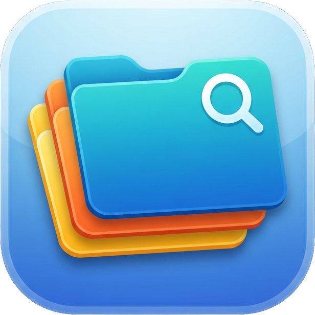

# Navigator

A premium, Finder-style file manager for macOS — built for a Windows → Mac switcher who wants the power of Windows 11 File Explorer with native Mac polish, plus a production AI toolkit for slot-art work wired directly into the right-click menu.

Written in Swift (SwiftUI + AppKit), compiled with `swiftc` — no Xcode project required.



## Requirements
- **Apple Silicon or Intel Mac** — the release is a **universal** binary
- **macOS 14 (Sonoma) or newer**
- Optional, and only for the features that use them: **Adobe Photoshop**, **After Effects**, a **fal.ai** API key, a company **Vertex** sign-in

## Install (no build required)

1. Download the latest **Navigator.zip** from the [**Releases**](../../releases/latest) page.
2. Unzip it and drag **Navigator.app** into your **Applications** folder.
3. **Right-click Navigator.app → Open → Open.** Navigator is self-signed rather than notarized, so a plain double-click is blocked the first time only.
4. Open **Navigator ▸ Setup & Permissions…** and work down the list.

Step 3 alternatives if you prefer: System Settings ▸ Privacy & Security ▸ *"Navigator was blocked…"* ▸ **Open Anyway**, or `xattr -dr com.apple.quarantine /Applications/Navigator.app`.

---

## Setup & Permissions

**Use the built-in window: Navigator ▸ Setup & Permissions…** (or Help ▸ Setup Assistant — same window). It shows **live status** for every permission, has a button per row that opens the exact System Settings pane, and explains the traps in place. That is far more reliable than following written paths, because two of these panes are genuinely hard to find and one of them shares its name with an unrelated pane.

[`PERMISSIONS.md`](PERMISSIONS.md) is the full reference behind that window — read it when handing Navigator to someone new, or when a feature isn't working and you want to know which switch is responsible.

The short version:

| | Needed for | Required? |
|---|---|---|
| **Full Disk Access** | All file browsing, in one grant — supersedes the per-folder switches | **Strongly recommended** |
| Files & Folders | Desktop / Documents / Downloads / network / USB, individually | Only if you skip Full Disk Access |
| **App Management** | **Navigator installing its own updates** | Recommended |
| Automation ▸ Photoshop | Remove BG, Quick Export as PNG, Generative Upscale | Only for those |
| Automation ▸ After Effects | Chroma Key BG | Only for that |
| Automation ▸ Finder | Saving comments in Get Info | Optional |
| Accessibility | The one-keystroke Open/Save dialog jump | Optional |
| Local Network | Discovering SMB servers for the sidebar | Optional |
| Finder extension | Navigator's submenu in Finder's right-click menu | Optional |
| Screen Recording | **Nothing. Navigator never asks.** | Never |

**App Management deserves attention** because it fails invisibly: with it off, an update downloads, silently fails to install, and offers itself again forever. The setup window reads its real status.

### AI provider credentials

Also in the setup window, because they fail the same way a permission does:

- **Vertex** (Google, company-metered) — a browser sign-in with your work account. No key to paste, no `gcloud` to install. Lasts ~30 days. Powers Restyle and the Imagen upscalers.
- **fal.ai** — one API key, stored in your login keychain. Powers Layerize and the fal upscalers.
- **OpenAI** — reserved; nothing uses it yet.

---

## Features

### File management
**Windows 11-style command bar** — **New ▾ · Cut · Copy · Paste · Rename · Share · Delete · Sort ▾ · View ▾ · ⋯ · Details**. **⌘ + scroll** resizes and cycles the view, like Explorer's Ctrl+scroll.

**File operations** — Copy / Cut / Paste (with numbered-copy paste-in-place) / Duplicate / Rename / **Batch rename** / Move to Trash / Compress / **Extract** (zip + tar) / New Folder / New Text File / Make Alias / **Make Symbolic Link**. Copy and move show a progress window and a conflict dialog (Keep Both / Replace / Skip). Most operations are **undoable (⌘Z)**, and failures are always reported — never silent.

**Views** — List (Details), Icon (small→extra-large), Gallery, and Column (Miller). The sidebar is an **expandable tree**. Navigator **remembers the view mode per folder**, switches image-heavy folders to large icons automatically, and **restores your scroll position when you go Back**.

**Drag and drop** works in every view and to and from other apps, including multi-file drags.

**Selection** — click, ⇧-click for a range, ⌘-click to toggle, and rubber-band selection in every view.

**Navigation** — editable address bar (⌘L), clickable breadcrumb, tabs, multiple windows, back/forward/up, type-to-select, and **dual pane (⌥⌘2)**. Reopens your tabs and window position on launch. **Auto-refresh** via FSEvents.

**Search** — instant name filter plus recursive Spotlight search with scope and kind filters.

**Metadata** — toggleable columns including on-demand **folder size**, and lazily from Spotlight: Duration, Dimensions, Tags. Rich **Get Info** with editable name, tags, comments, permissions and Open With. Set colored **Finder tags** and comments.

**Pin folders (Quick Access)** — right-click any folder ▸ **Pin to Sidebar**; pinned favorites show a pushpin you can click to unpin, and **drag to reorder** them. Home stays anchored at the top.

**Settings (⌘,)** — default view and sort for new windows, show hidden files, confirm-before-Trash, and a **Thumbnails** control (All / Images only / Off) worth turning down on slow network drives.

**Open in Terminal** and **Quick Look (Space / ⌘Y)** on any selection.

### Images
**Thumbnails** for images, video poster frames, **PSD/PSB**, **PDF** and **RAW** via QuickLook. Animated GIFs play. Thumbnails **notice when a file's contents change** — re-export over the same filename and the thumbnail follows.

**Image viewer** — zoom (scroll, ⌘+/−/0, slider), drag-to-pan, ←/→ through the folder, dimensions and file size in the bottom bar.

**Swipe Compare** — select **two or more** images and drag a divider between them. With more than two, the left side stays as your reference while ←/→ step the right side through the rest, with a button to promote whichever you're looking at. Built for judging a set of variations against one baseline.

### AI toolkit
All of it sits in the right-click menu, runs in the background with a progress indicator, never modifies your originals, and reports what a call actually cost.

**Layerize (AI)** — splits an image into transparent layers via Seedream 5.0 Pro: background plus each element as its own PNG, named for what it is (`3bears_L02_Grizz_Bear_Character.png`). Writes a `<Name>_Layers/` folder plus `_layers.json` with each layer's bounding box and description so a layout can be rebuilt. It **inpaints what was hidden** — scenery behind a character comes back as usable background rather than a hole. Navigator picks the resolution tier, decides whether the base layer is worth keeping, and preflights the service's limits before sending anything.

**Upscale (AI)** — Crystal, AuraSR, Topaz, Imagen 4 ×2/×4, and a **free local resample** that needs no key at all. The ordering isn't vendor marketing: a round-trip test (real art downscaled, upscaled, compared to the original) put Crystal first on structural fidelity, and found the free local resample beating two paid endpoints on flat graphic art.

**Restyle (AI)** — restyle one image or a batch against a reference, via Nano Banana 2 / Pro on Vertex. Out-of-ratio inputs are padded to the nearest supported aspect and cropped back afterwards, because sending them raw makes the model silently delete content.

**Prep for AI** — fits an image to the nearest ratio the image models accept and fills the padding with an **adaptive backing colour** chosen from the image itself: it extends an existing flat chroma field, or picks the colour furthest from everything in the art. A fixed palette can collide with the subject — a tortoise containing pure white keyed away part of the tortoise.

**Remove BG** · **Chroma Key BG** · **Quick Export as PNG** — Photoshop and After Effects driven directly, single file or whole folder.

**Generative Upscale (Firefly)** — Photoshop's own upscaler, scripted. Adobe's Firefly model only, and Navigator refuses to save the result if Photoshop hands back a different one.

### Integration
**Navigator's own submenu in Finder's right-click menu** — Open in Navigator, Open Location in Navigator, and the AI toolkit: Remove BG, Prep for AI, Upscale, Restyle, Layerize, Quick Export as PNG. It's a Finder extension, so **it works whether or not Navigator is running** — clicking an item launches it on demand. Enable it in the setup window. **Finder Quick Actions** can be installed too (AI ▸ Install Finder Quick Actions).

**Open/Save dialog path bridge** — the feature Photoshop and Chrome are missing. Copy any folder path in Navigator, then in *any* app's Open or Save dialog press **⌃⌥⌘G** to copy the path (then ⇧⌘G and ⌘V yourself), or **⌃⌥⇧⌘G** to do all of it in one keystroke. Google Drive paths pasted from a coworker are remapped to your own Drive account. The chord is configurable (G / P / K). The one-key version needs Accessibility; the copy version doesn't.

**Google Drive** — **Copy Google Drive Link** and **Open in Google Drive** give a real `drive.google.com` link read from Drive's own item ID, so you can share a location without pasting a path full of your username. A Drive path pasted from another user is auto-remapped to your account.

**Network** — **Connect to Server (⌘K)**, Bonjour SMB discovery in the sidebar, mounted shares under Locations, and automatic safe SMB tuning on launch. **Export / Import Favorites…** hands a team the same drive shortcuts as a `.json` — personal home folders are excluded, so the same public build works for everyone.

**Dock menu** — New Window, New Tab, Find…, Go to Folder…, Connect to Server…, Applications, Volumes, Home.

**Diagnostics** — **Reset Drag & Drop** and **Copy Drag Diagnostics** for the rare wedged session, and `~/Library/Logs/Navigator.log` records anything that goes wrong, including errors a system framework catches and hides.

## Keyboard shortcuts
| Shortcut | Action |
|---|---|
| ⌘L / ⌘F | Focus address bar / search |
| ⌘T / ⌘W / ⌘N | New tab / close tab / new window |
| ⇧⌘N / ⌥⌘N | New folder / new text file |
| ⌘C / ⌘X / ⌘V | Copy / cut / paste files |
| ⌘I / ⌘D / ⌘Y or Space | Get Info / Duplicate / Quick Look |
| ⌘⌫ / ⇧⌘⌫ | Move to Trash / Empty Trash |
| ⌘[ / ⌘] / ⌘↑ | Back / Forward / Enclosing folder |
| ⇧⌘P / ⌥⌘S / ⌥⌘2 | Toggle preview / sidebar / dual pane |
| ⇧⌘. / ⌘R / ⌘Z / ⌘K | Show hidden / Refresh / Undo / Connect to Server |
| ⌘J / ⌘, / F2 | View options / Settings / Rename |
| ⌘ + scroll | Resize / cycle the view |
| ⌘+ / ⌘− / ⌘0 | Zoom in / out / fit *(image viewer)* |
| **⌃⌥⌘G** | **Copy path for another app's Open/Save dialog** |
| **⌃⌥⇧⌘G** | **Same, one keystroke — needs Accessibility** |

---

## Updating

Navigator updates itself from this repo's Releases.

- **Automatic:** on launch, at most once a day, it checks for a newer release and asks.
- **Manual:** **Navigator ▸ Check for Updates…**

It downloads the new `Navigator.zip`, replaces the app in `/Applications`, and relaunches. Favorites, view settings and pinned drives all live in `~/Library`, not in the bundle, so they carry over untouched.

**What survives an update, precisely:**

- **macOS permissions do.** Release builds are signed with a stable **"Navigator Dev"** identity, so Full Disk Access, Files & Folders, Automation, Accessibility and App Management persist. Verified across many rebuilds.
- **The keychain ACL does not.** macOS ties that to the binary rather than the signing identity, so the first AI action after an update asks once for your login-keychain password. Choose **Always Allow**. Your fal.ai key is fine and never needs re-entering — if you dismiss that prompt, Navigator tells you exactly that rather than claiming no key is stored.
- **Installing needs App Management** (above). Without it the download succeeds and the swap silently doesn't.
- **Launch Navigator once after updating** so Finder re-registers the extension — the bundle path changes, so the Finder menu goes stale until it does.

---

## Build from source

Needs the **Xcode Command Line Tools** (`xcode-select --install`). One command builds, signs, and installs:

```bash
git clone https://github.com/michaelericksonh5/Navigator.git NavigatorApp
cd NavigatorApp
bash rebuild.sh
open /Applications/Navigator.app
```

Layout:

| | |
|---|---|
| `main.swift` | the app — SwiftUI + AppKit |
| `NavigatorCore.swift` | pure logic, no AppKit, unit-tested |
| `FinderExt.swift` | the Finder Sync extension (its own bundle) |
| `Navigator*.jsx` | the Photoshop / After Effects scripts |
| `rebuild.sh` | builds, signs and installs the universal app + extension |
| `quickbuild.sh` | faster arm64-only variant for iterating |
| `runtests.sh` | **450 tests** over `NavigatorCore.swift` |

Rules worth keeping in mind if you contribute: anything that can be pure logic goes in `NavigatorCore.swift` so it can be tested, and every non-obvious constant should be traceable to a measurement rather than a guess.

### Stable code signing (recommended)
If a self-signed **"Navigator Dev"** certificate exists in your login keychain, `rebuild.sh` uses it so the app's identity stays constant across rebuilds — which is what makes macOS remember its permission grants instead of re-prompting every build. Without it the build falls back to ad-hoc signing (still runs; grants reset each build). A backup lives in `~/.navigator-signing/`.

### Sharing with someone else
Send them the [Releases](../../releases/latest) download. Because it isn't notarized, their first launch needs the one-time right-click → Open. Zero-warning distribution would require an Apple Developer ID plus notarization.

## Known limitations

- **Cannot replace Finder** as the system folder handler — macOS locks that to Finder. Navigator registers as a folder app instead, so Open With, "Always Open With", the Services entry and `open -b com.merickson.navigator <folder>` all work. The setup window says so rather than showing it as a setting you can fix.
- **Auto-refresh** covers local and cloud (File Provider) folders. **SMB shares don't push notifications** — use ⌘R.
- **Local Network status can't be read.** macOS exposes no API for it, so the setup window proves it functionally: green once Navigator has actually discovered a server. On a network where nothing advertises itself it stays "Unknown" even when the switch is on, which is normal and not a fault.
- **Photoshop Generative Upscale** needs Firefly generative credits, which are a **capped monthly allowance**. Output is limited to 6144px per side and an aspect ratio between 1:4 and 4:1, so ×4 is out of reach for most production art.
- **Empty Trash** clears only `~/.Trash`, not per-volume trashes.
- **Not notarized** — hence the one-time first-launch step.

## License
Personal project. No warranty.
